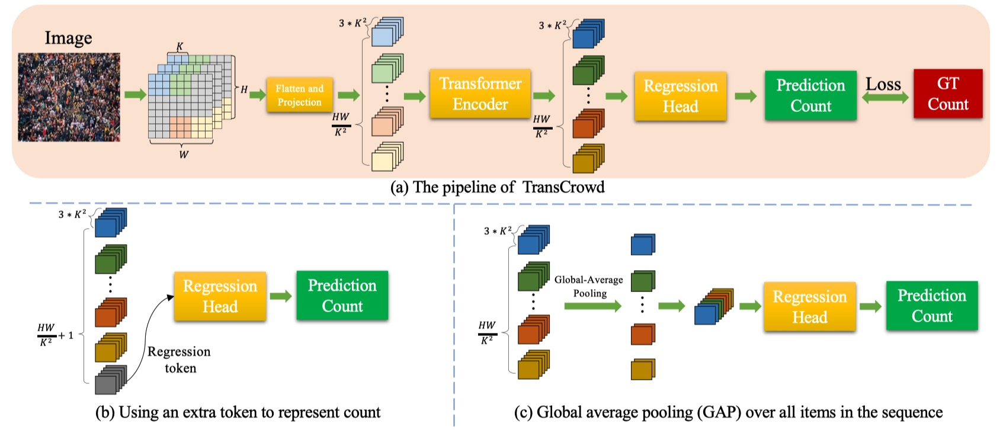

# TransCrowd
* An officical implementation of TransCrowd: Weakly-Supervised Crowd Counting with Transformer. To the best of our knowledge, this is the first work to adopt a pure Transformer for crowd counting research. We observe that the proposed TransCrowd can effectively extract the semantic crowd information by using the self-attention mechanism of Transformer.

* Paper [Link](https://arxiv.org/abs/2104.09116)
## Overview


# Environment

	python >=3.6 
	pytorch >=1.5
	opencv-python >=4.0
	scipy >=1.4.0
	h5py >=2.10
	pillow >=7.0.0
	imageio >=1.18
	timm==0.1.30

# Datasets

- Download ShanghaiTech dataset from [Baidu-Disk](https://pan.baidu.com/s/15WJ-Mm_B_2lY90uBZbsLwA), passward:cjnx; or [Google-Drive](https://drive.google.com/file/d/1CkYppr_IqR1s6wi53l2gKoGqm7LkJ-Lc/view?usp=sharing)
- Download UCF-QNRF dataset from [here](https://www.crcv.ucf.edu/data/ucf-qnrf/)
- Download JHU-CROWD ++ dataset from [here](http://www.crowd-counting.com/)
- Download NWPU-CROWD dataset from [Baidu-Disk](https://pan.baidu.com/s/1VhFlS5row-ATReskMn5xTw), passward:3awa; or [Google-Drive](https://drive.google.com/file/d/1drjYZW7hp6bQI39u7ffPYwt4Kno9cLu8/view?usp=sharing)


# Prepare data

```
cd data
run  python predataset_xx.py
```
“xx” means the dataset name, including sh, jhu, qnrf, and nwpu. You should change the dataset path.

Generate image file list: 
```
run python make_npydata.py
```

# Training

**Training example:**

```
python train.py --dataset ShanghaiA  --save_path ./save_file/ShanghaiA --batch_size 24 --model_type 'token' 
python train.py --dataset ShanghaiA  --save_path ./save_file/ShanghaiA batch_size 24 --model_type 'gap'
```
Please utilize a single GPU with 24G memory or multiple GPU for training. On the other hand, you also can change the batch size.

# Testing
**Test example:**

Download the pretrained model from [Baidu-Disk](https://pan.baidu.com/s/1OJZmZfDGOuHCVMtJwrPHUw), passward:8a8n

```
python test.py --dataset ShanghaiA  --pre model_best.pth --model_type 'gap'
```

# Reference
If you find this project is useful for your research, please cite:
```
@article{liang2021transcrowd,
  title={TransCrowd: Weakly-Supervised Crowd Counting with Transformer},
  author={Liang, Dingkang and Chen, Xiwu and Xu, Wei and Zhou, Yu and Bai, Xiang},
  journal={arXiv preprint arXiv:2104.09116},
  year={2021}
}
```
